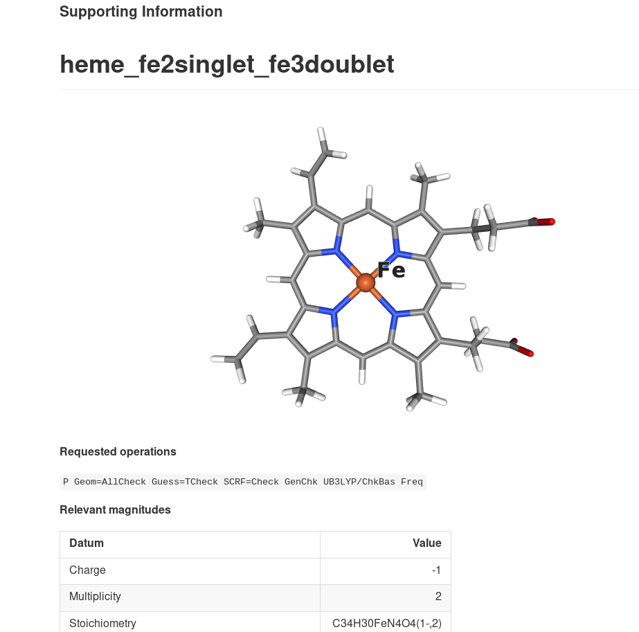

# ESIgen: Supporting information generator

Automatically generate supporting information documents for your Chemistry publications online.

# Usage

## Online server

1. Visit http://esi.insilichem.com and upload your Computational Chemistry outputs there. Any of the examples in [cclib data](https://github.com/cclib/cclib/tree/master/data) should work.
2. Choose one of the [builtin templates](docs/templates.md#builtin-templates) or [create your own](docs/templates.md#syntax).
3. Profit! You can generate a PDF, print it with your browser, download a zip file with all the contents or even publish it to a [Gist](https://gist.github.com/anonymous/8a5890c9e18de78ba90e67c3109b074f). All export options are listed at the bottom of the file.

This is only a demo server, so performance won't be stellar... All files will be deleted within 1h and we won't collect any data from you. Refer to the [local installation docs](docs/install.md) if you want to setup your own (local) server.

## Command-line (batch processing)

1. [Install](docs/install.md) in your computer.
2. Run `esigen filename.log`. That's it!

# Documentation

- [Local installation](docs/install.md)
- [How to write your own ESIgen templates](docs/templates.md)
- [Use ESIgen Python API programmatically](docs/developer.md)

# Acknowledgments

Inspired by [Chauncey Garrett's collection of scripts](https://github.com/chauncey-garrett/gaussian-tools), this project was conceived as a Python-only CLI attempt at solving the same problem. Then more features were added (like markdown reports or image rendering), and finally was turned into a online service.

ESIgen is possible thanks to great open-source projects:

- [CCLib](https://github.com/cclib/cclib). Gaussian output file parsing.
- [NGL](https://github.com/arose/ngl). Interactive 3D preview in the browser.
- [Flask](https://github.com/pallets/flask). Web backend.
- [PyMol](https://sourceforge.net/projects/pymol/). Unattended 3D image rendering.
- [HTML5 UP](https://html5up.net/). Base web design.
- [Dropzone](https://github.com/enyo/dropzone). Drag & drop uploads.